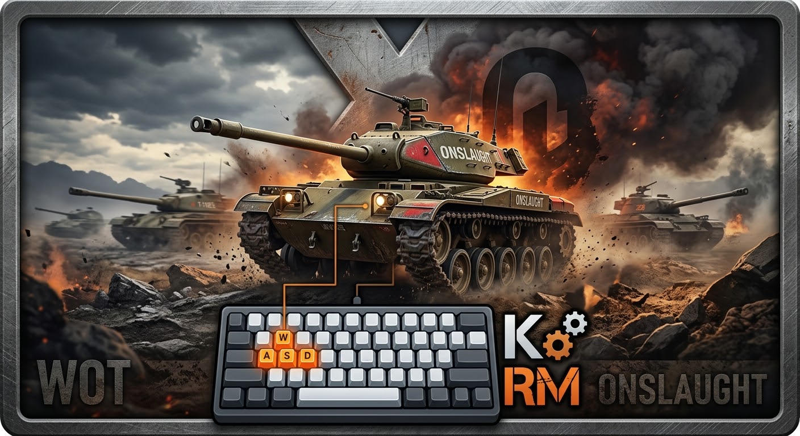
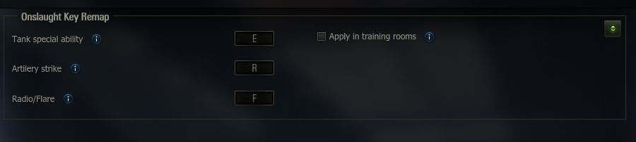

# Onslaught Key Remap



If you like to keep your abilities close to WASD in Onslaught but use the
default controls everywhere else, you know the problem: you end up
manually swapping your key bindings back and forth every time you switch
between Onslaught and Random battles - and sooner or later you forget,
and find yourself mid-fight in Onslaught fumbling for keys that are still
set up for Randoms.

Onslaught Key Remap fixes that. Set your preferred keys for the three
Onslaught-only abilities (Tank Special Ability, Artillery Strike,
Radio/Flare) once, from an in-game settings panel, and the mod takes care
of switching them in and out automatically every time you enter or leave
Onslaught - your Random battle controls are never touched.

## Features

- Choose your own key for each of the three Onslaught ability slots
- Change bindings anytime from the in-game mod settings menu - no file
  editing, no restart needed
- Your other key bindings are left alone; nothing else on your keyboard
  is affected
- Optional setting to also apply your custom keys inside training rooms
- Settings are saved automatically and carry over between game sessions

## Screenshots



## Dependencies

The settings panel is provided by a small chain of companion mods.
Install all of them alongside Onslaught Key Remap:

- [**Mod Settings API**](https://github.com/IzeBerg/ModsSettingsAPI)
- [**Mods List API**](https://gitlab.com/wot-public-mods/mods-list)
- [**WoT.Gameface**](https://gitlab.com/openwg/wot.gameface)

Without them, Onslaught Key Remap still works, just with the default
keys (E / R / F) and no in-game settings panel.

### Dependency tree

Each one depends on the one below it, so all three need to be installed
together for the settings panel to appear:

```
Onslaught Key Remap
└─ Mod Settings API
   └─ Mods List API
      └─ WoT.Gameface
```

## Installation

1. Download the latest release.
2. Make sure the dependencies above are installed too.
3. Copy the `.wotmod` file into your `World_of_Tanks/mods/<game version>/`
   folder.
4. Start the game - that's it.

## How to set it up

1. Open the garage.
2. Click the mods icon in the corner and open **Onslaught Key Remap**.
3. Click into each key field and press the key you want to use.
4. (Optional) Turn on "Apply in training rooms" if you also want your
   keys to work there.
5. Close the panel - your changes are saved automatically.

## Compatibility

- Works alongside other mods; only touches the three Onslaught ability
  keys, and only while you're in an Onslaught match.
- Tested on game version *2.4.0.1*.

## Feedback & Support

Found an issue or have a suggestion?

**Email:**  7deividmladenov007@gmail.com
**Discord:**  dek07420
**GitHub:** or simply open an issue inside the repository


## Credits

- Settings panel powered by **Mod Settings API**, **Mods List API**, and
  **WoT.Gameface** - see the dependency tree above for links.

## License

MIT - see [LICENSE](LICENSE). Free to use, fork, and modify; contributions
are welcome.
